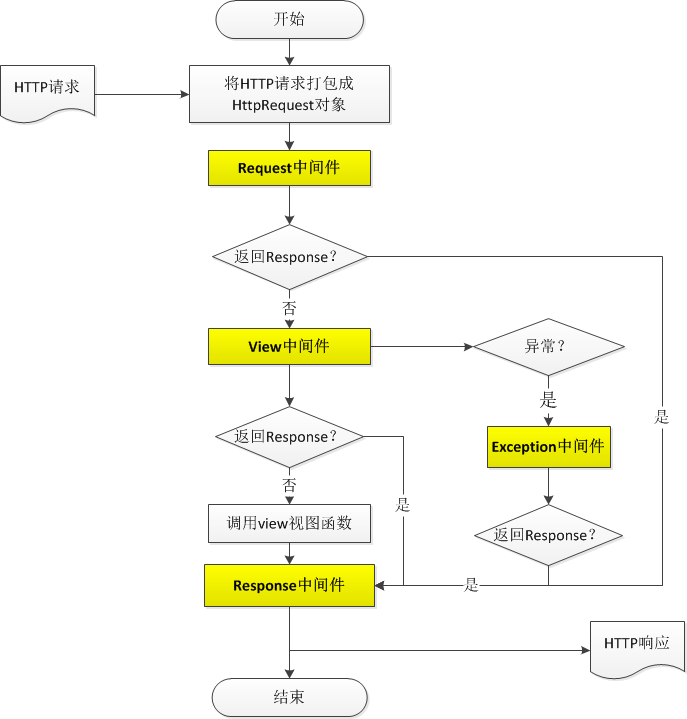

# Python Django Framework

1. Python3 Django Web框架（Web framework）。
2. 本环境采用基于Python3.11-django4.1.3。
3. Django是一个由Python写成的Web应用框架。Django的主要目的是简便、快速的开发数据库驱动的网站。它强调代码复用，多个组件可以很方便的以“插件”形式服务于整个框架，Django有许多功能强大的第三方插件，甚至可以很方便的开发出自己的工具包。

## Django 4.0新特性

[官网介绍](https://docs.djangoproject.com/en/dev/releases/4.0/)

## 目录结构

DjangoDefaultTemplates使用Django默认的模板引擎开发   
DjangoMakoTemplates使用mako模板引擎开发

## 模板引擎

### Django默认模板引擎

### mako模板引擎

[mako参考文档](https://docs.makotemplates.org/en/latest/index.html)

## Django Middleware

1. django的核心在于中间件middleware，django所有的请求、返回都由中间件来完成。
2. 中间件就是处理HTTP的request和response的，类似插件，比如有Request中间件、view中间件、response中间件、exception中间件等。
3. Middleware都需要在项目“settings.py”中的MIDDLEWARE_CLASSES进行定义。

Django请求处理流程

Django表单请求流程

## Django LogEntry

LogEntry是在后台开发中经常用到的模块，它在admin是默认开启的。 可以使用LogEntry模块记录所有用户的操作记录。一方面可以用来监督，另一方面可以用来做回滚。

## DRF Django Rest framework

## Django ORM

### Model id和pk

如果一个model里没有显示声明哪一个字段（field）是主键（即在某个字段里声明primary_key=True），则django会自动生成一个名为id的AutoFields作为主键。model里的主键都有一个别名叫做pk（primary_key的缩写），无论这个主键是自动生成的还是我们指定的。使用pk和使用主键的名字是一样的效果。

## Django Admin

## Django Paginator Page

## Django Cache

## 模板引擎

#### Django默认模板引擎

#### mako模板引擎

> Mako 是用Python编写的模板引擎。从概念上讲，mako是一种嵌入式Python（即Python Server Page）语言，模版被编译成Python代码，使用python解释器执行。mako用于外网热门网站 reddit.com ，同时也是Pylons和Pyramid Web框架默认模板语言。
> 速度非常快，在语法和功能方面对任何熟悉Python的人都非常熟悉

## django-celery

升级 django-celery 规避重连风险
https://bk.tencent.com/docs/document/7.0/170/13914

## Django Admin

## Django uWSGI Nginx

## Django Gunicorn

## Django常用命令

> startapp mako_frame  
> showmigrations [app_label]  
> makemigrations [appname]  
> migrate [appname]

## 应用案例

#### 使用Django提供RESTful API服务

[Django工程模板]()   
[查看项目案例]()

#### 使用cookiecutter创建Django项目

#### 基于蓝鲸开发模板开发SaaS应用

1. 使用Django default templates
2. 使用mako templates
   [蓝鲸开发框架工程模板]()
   [查看项目案例](https://gitee.com/SteveRocket/bk_demo.git) 包含Python基础实战、奖项申报、文件备份功能。

## 技术性参考文档

1. [Django 模板语法](https://docs.djangoproject.com/zh-hans/4.1/ref/templates/language/)
2. [Django 模板API](https://docs.djangoproject.com/zh-hans/4.1/ref/templates/api/)
3. [Mako官方文档](https://docs.makotemplates.org/en/latest/)
4. [参考资料](https://www.makotemplates.org/)