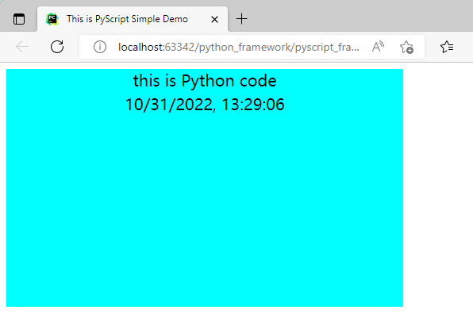

# Run Python in Your HTML
## What is PyScript? 
1. PyScript是一个框架，允许用户使用HTML的界面以及Pyodide、WASM和现代web技术的强大功能在浏览器中创建丰富的Python应用程序。PyScript框架为每一个体验级别的用户提供了一种表达能力强、易于学习的编程语言和无数应用程序。  
2. 允许我们将 Python 代码嵌入到 HTML 中，并在浏览器中允许。PyScript 旨在为用户提供一流的编程语言，该语言具有一致的样式规则、更具表现力且更易于学习。
3. 类似于JavaScript。

## 核心组件
__浏览器中的Python：__ 在不依赖服务器端配置的情况下，启用插入式内容、外部文件托管（基于 Pyodide 项目）和应用程序托管。  
__Python生态系统：__ 运行许多流行的Python包和科学堆栈（如numpy、panda、scikit learn等）。  
__Python与JavaScript：__ Python与JavaScript对象和命名空间之间的双向通信。  
__环境管理：__ 允许用户定义要运行页面代码的包和文件。  
__可视化应用程序开发：__ 使用现成的策展UI组件，如按钮、容器、文本框等。  
__灵活的框架：__ 一个灵活的框架，可以直接在Python中创建和共享新的可插入和可扩展组件。  


## 安装与使用
在工程中引入本地库，[依赖包下载](https://codeload.github.com/pyscript/pyscript/zip/refs/heads/main)  
或使用在线库
```html
<link rel="stylesheet" href="https://pyscript.net/latest/pyscript.css" />
<script defer src="https://pyscript.net/latest/pyscript.js"></script>
```

#### 示例demo1：py-script



## 特性
1. runtime加载方面的性能不够好，还有待进一步提升。

## 参考资料 
1. [详细参考官方文档](https://pyscript.net/)
2. [Github](https://github.com/pyscript/pyscript)
3. [pyscript example](https://pyscript.net/examples/)
4. [pyodide](https://pyodide.org/en/stable/)
5. [Guides](https://docs.pyscript.net/latest/guides/index.html#guides)
6. [Getting started with PyScript](https://docs.pyscript.net/latest/tutorials/getting-started.html)
7. [Tutorials](https://docs.pyscript.net/latest/tutorials/index.html)